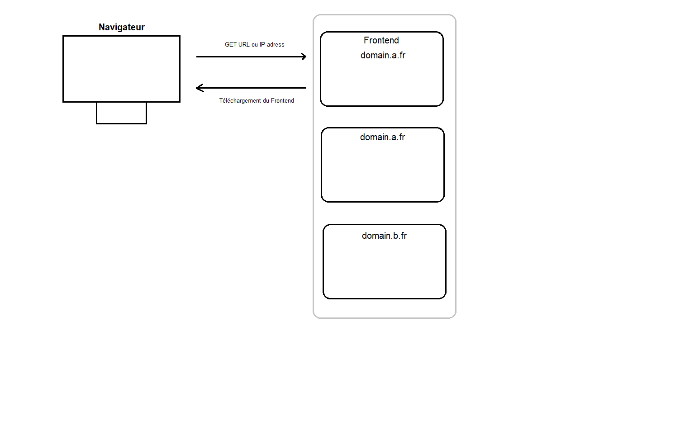
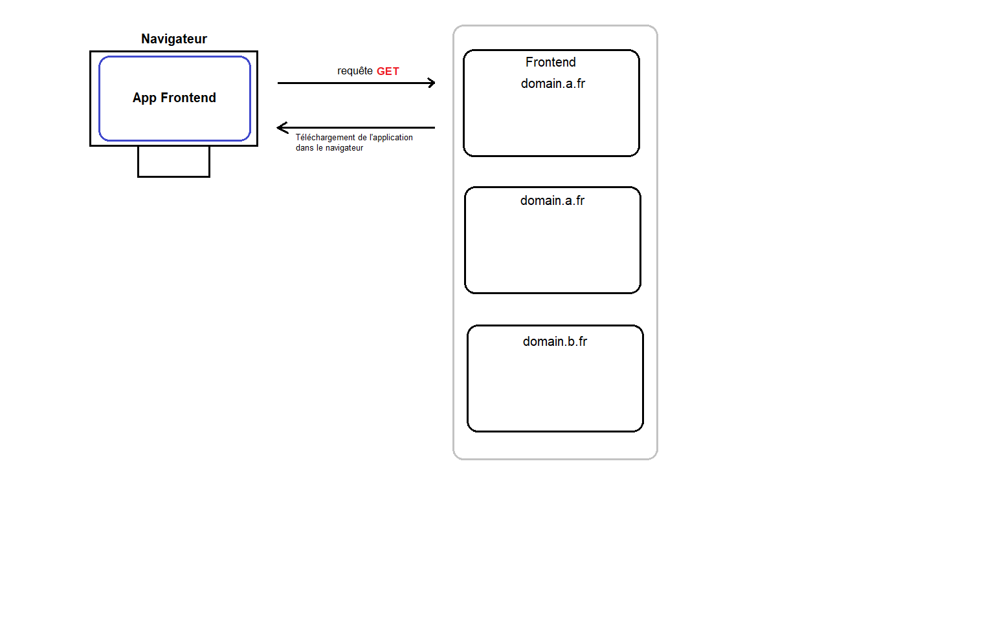
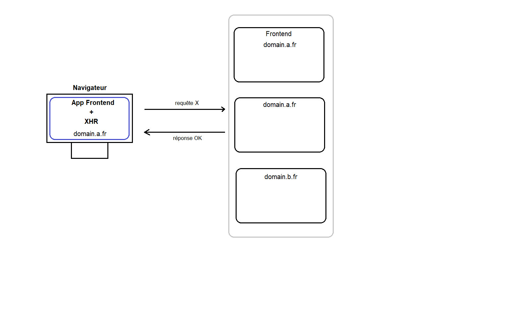
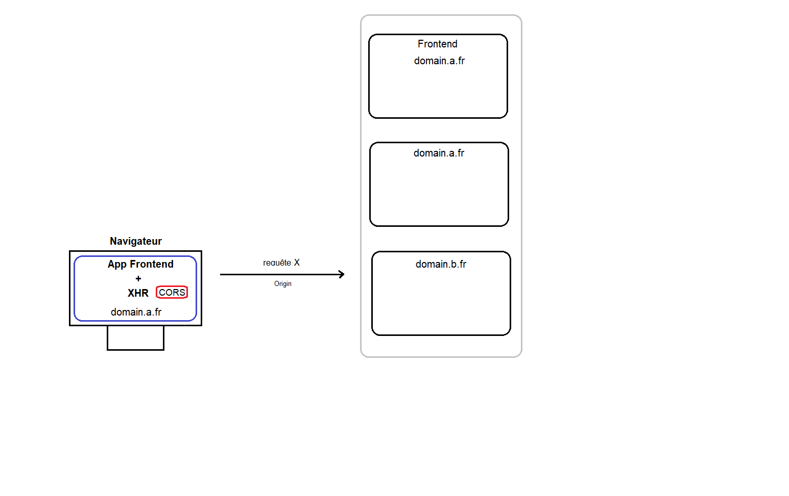
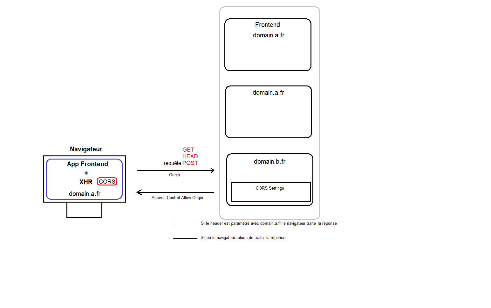
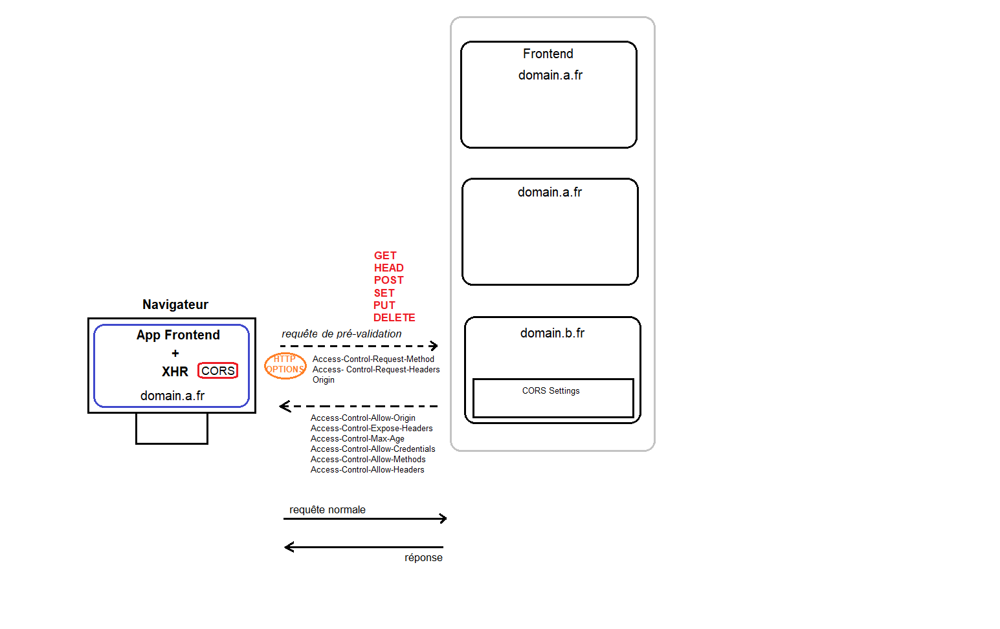
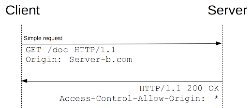
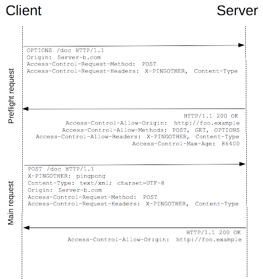

# La politique de sécurité CORS

# SOP and CORS

Avant que la requête HTTP soit envoyée, XHR compare l'URL de la page distante à celle présente dans la méthode `open()`, pour déterminer si les deux appartiennent au même domaine (et donc répondent au contexte de Same Origin Policy).  
Si ce n'est pas le cas, la requête est soumise à la politique d'accès aux données.

# CORS ?

CORS est une normalisation W3C signifie **cross-origin resource sharing** ou partage de ressources de domaines différents.  

Il permet de déterminer, lors d'une connexion à une application distante, un contrôle de traitement à des données qui sont stockées sur un autre domaine que celui de l'application en question.  

Le CORS est fondé sur l’utilisation d’en-têtes HTTP contenus dans des XMLHttpRequest (XHR)

# AVANT CORS : JSONP
Auparavant, il était possible de faire du requêtage cross-domain avec JSONP. Néanmoins celui-ci était limité à la  seule méthode GET, qui plus est en utilisant un contournement du [_Same-Origin Policy_](https://en.wikipedia.org/wiki/Same-origin_policy).  

L'intérêt du CORS est qu'il permet d'utiliser les méthodes GET, POST, PUT and DELETE.

# Exemple

Connexion à une application web liée à deux backend de domaines différents

# 

# 

# 

# 

# 

# 

## Rappel : XML Http Request (XHR)

  XMLHttpRequest (XHR) est une API, asynchrone par défaut, qui se présente sous la forme d'un objet Javascript.  

  Elle est responsable du management des HTTP requests entre le client et le serveur d'une part, et le serveur et les éventuels domaines relatifs à son contenu.

  Note : si XHR est toujours utilisé, il est désormais conseillé d'utiliser l'API [_Fetch_](https://developer.mozilla.org/fr/docs/Web/API/Fetch_API/Using_Fetch), disponible pour la majorité des navigateurs.  

L'utilisation XHR implique deux méthodes obligatoires 

### La méthode open()

La méthode **`open()`** initialise l'objet XHR avec les paramètres suivants :

  * `request_mode` : *définit le choix de la requête HTTP => GET ou POST*
  * `url` : *serveur URL*
  * `mode` : *façon dont la requête doit être traitée par le serveur : asynchrone ou synchrone*

# La méthode send()
La méthode **`send()`** *envoie l'objet XHR avec ses données* :  

  * *Pour envoyer les données avec un `POST`, on doit renseigner un string dans le body de la requête avec les paramètres*
  * *Pour envoyer les données avec un `GET`, le body doit être `null`*

## 5 status
On observe 5 statuts pour cette XHR grâce à l'event listener `onreadystatechange` :

|Code|        État      |           Description         |
|----|--------------    |----------------|---|---|
|  0 |    `UNSENT`      |Object ready, open() method not already called   |   
|  1 |    `OPENED`      |method open() not already called  |
|  2 |`HEADERS_RECEIVED`|method send()   |   
|  3 |    `LOADING` 	  |Receipt in progress, the received data are partial|        
|  4 | 	   `DONE` 	    |Request done |

## CORS Structure

CORS est basé sur un un principe de headers HTTP  **requests** et **reponses**, contenus dans des XHR.
Ceux-ci permettent au client et au serveur d’en savoir suffisamment l’un sur l’autre afin de déterminer si la requête ou la réponse cross-domain doit réussir ou échouer.
### La spécification du CORS distingue deux cas d'utilisation :

### 1.Requêtes simples

*On utilise une requête simple pour faire appel aux méthodes `GET`, `HEAD` ou `POST`.*

#### PARTICULARITES POUR LA METHODE POST

**Pour l'utilisation de la méthode `POST`**, seuls les contenus avec les valeurs suivantes sont supportées dans le body :
- text/plain
- application/x-www-form-urlencoded
- multipart/form-data

Si la ressource distante accepte le cross-domain, la réponse est directement envoyée. Sinon, le client reçoit une erreur.

### 2.Requêtes de pré-vérification (ou Preflighted requests)
- Lorsque le contexte ne permet pas d'utiliser une requête simple, une première requête de pré-vérification avec la méthode **HTTP OPTIONS** est envoyée par le client à l'application distante pour vérifier le contexte cross-domain.

- Si c'est le cas, le client va envoyer une requête pour accéder aux données de l'application distante.

* La méthode **HTTP OPTIONS** utilise :
    * la méthode `Access-Control-Request-Method`
    * l'en-tête `Access-Control-Request-Headers`
    * l'en-tête `Origin`

# 

## HTTP header ___requests___

### Origin
Le header `Origin` indique le nom du serveur à l'origine de la requête d'accès cross-domain ou de la requête d'accès pré-vérifié.

  Exemple :

            Origin: https://developer.mozilla.org
            Origin: < adress.IP >

### Access-Control-Request-Method
Le header `Access-Control-Request-Method` est utilisé lorsqu'une requête pré-vérifiée est émise pour faire connaitre au serveur quelle **méthode** sera utilisée lorsque la requête actuelle sera faite .

  Exemple :

            Access-Control-Request-Method: POST

### Access-Control-Request-Headers
`Access-Control-Request-Headers` est utilisé lorsqu'une requête pré-vérifiée est émise pour indiquer au serveur quels seront **les entêtes HTTP** utilisés lorsque sera faite la requête actuelle.

  Exemple :  

            Access-Control-Request-Headers: Content-Type, X-Custom-Header

## HTTP header  ___responses___

### Access-Control-Allow-Origin
Le paramètre `origin` spécifie une URI qui peut accèder à la ressource.

  Pour permettre l'accès ouvert à une requête de  :

    Access-Control-Allow-Origin: *

  To allow https://developer.mozilla.org to access your resource, you can specify :

    Access-Control-Allow-Origin: "https://developer.mozilla.org"

### Access-Control-Allow-Credentials

Cet en-tête fait écho au comportement par défaut : certaines informations ne sont pas réémises automatiquement si le domaine est différent.

En l'occurrence, les en-têtes contenant les cookies (avec le session ID) et les informations d'authentification (`Basic: user_name:password`, digest, ...) sont supprimés.

  Pour l'activer, au cas où, avec XHR :

            var xhr = new XMLHttpRequest();
            xhr.open('GET', 'http://example.com/', true);
            xhr.withCredentials = true;
            xhr.send(null);

  Avec fetch :

            fetch(url, {
            credentials: 'include'  
            })

### Access-Control-Expose-Headers
__`Access-Control-Expose-Headers`__ : permet de lister les headers authorisés

            Access-Control-Expose-Headers: Content-Length  

  Il est possible d'utiliser plusieurs headers en les séparant par une virgule :  

            Access-Control-Expose-Headers: Content-Length, X-Kuma-Revision

### Access-Control-Max-Age
__`Access-Control-Max-Age`__ : permet de déterminer la durée pendant laquelle la preflight request sera disponible dans le cache.

    Example :
            Access-Control-Max-Age: 600

### Access-Control-Allow-Methods
__`Access-Control-Allow-Methods`__ : spécifie la ou les méthodes  ayant accès à la ressource en réponse à une preflight request.

    Example :
            Access-Control-Allow-Methods: POST, GET, OPTIONS

### Access-Control-Allow-Headers
The `Access-Control-Allow-Headers` :  est utilisé en réponse à une preflight request pour indiquer les HTTP headers disponibles via Access-Control-Expose-Headers suite à une requête normale.

    Example :
            Access-Control-Allow-Headers: X-Custom-Header

## Behaviour

- Il est possible d'utiliser plusieurs CORS sur le même backend. Pour cela il suffit d'indiquer dans le CORS setting les 'origins' séparées par une virgule :

        http://localhost:8080,https://dreamfactory.com

## Ressources

[_CORS (W3C)_](https://www.w3.org/TR/cors/)  
[_XHR (MDN)_](https://developer.mozilla.org/fr/docs/Web/API/XMLHttpRequest/)  
[_Same Origin Privacy (Bart Konieczny)_](https://www.bart-konieczny.com/fr/blog/securite-des-applications-web/explication-same-origin-policy/)  
[_SOP & CORS (Stackoverflow)_](https://stackoverflow.com/questions/14681292/same-origin-policy-and-cors-cross-origin-resource-sharing/)  
[_AJAX - SOP - JSONP (UPEM)_](http://igm.univ-mlv.fr/~dr/XPOSE2009/ajax_sop_jsonp/xmlhttprequest_methodes.html/)  

<!--

Texte prez :

Le navigateur émet vers le FrontEnd uen requête get URL/IP
Le navigateur récupère l'application du frontend, avec son XHR

Le frontend émet une requête vers le Backend_A
Le navigateur reconnaît un contexte SOP car les domaines sont identiques

Si le frontend émet une requête vers le Backend_B
Le navigateur reconnaît un contexte CORS car le header "Origin" est présent dans la requête, il indique le serveur à l'origine de la requête

Si la requête envoyée par le navigateur est un GET / HEAD / POST
=> XHR envoie au serveur du backend une requête HTTP avec un header Origin, qui appelera une réponse Access-Control-Allow-Origin
afin de valider l'accès

Si la requête envoyée par le navigateur est un SET/PUT/DELETE
=> Le XHR envoie alors des requêtes de validation préliminaires
avec la méthode HTTP OPTIONS qui utilise  les headers :

- Access-Control-Request-Method
- Access- Control-Request-Headers
- Origin

Le Backend B renverra alors des Headers de preflight responses avec lesquelles il aura été implémenté :
- Access-Control-Allow-Origin
- Access-Control-Expose-Headers
- Access-Control-Max-Age
- Access-Control-Allow-Credentials
- Access-Control-Allow-Methods
- Access-Control-Allow-Headers

Si accès, la main request est émise par XHR avec les mêmes headers. La réponse en revanche en contiendra que le header Access-Control-Allow-Origin.

Il est donc important de définir, pour l'accès à une application, le contexte relatif à l'accès à ses données

Note : il est possibile de définir plusieurs 'origin' en les définissant dans le CORS SETTING du backend et en les séparant par une virgule -->
